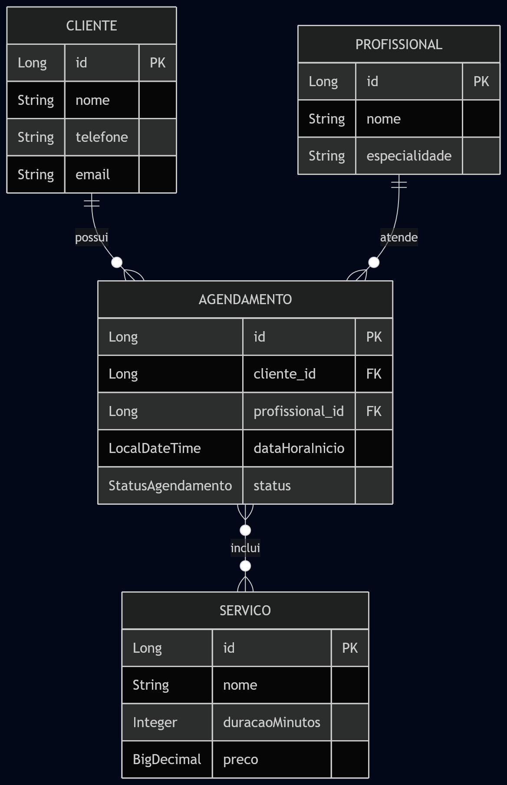

# StudioAgenda

Sistema de agendamento para salões de beleza. Permite registrar clientes, profissionais,
serviços oferecidos e criar agendamentos vinculando múltiplos serviços a um único horário,
com verificação automática de conflito de agenda por profissional.

## Funcionalidades previstas

- Cadastro de clientes, profissionais e serviços (CRUD)
- Criação de agendamentos vinculando cliente, profissional, um ou mais serviços e data/hora de início
- Cálculo automático da duração total e valor total do agendamento, com base nos serviços selecionados
- Verificação de conflito de horário: um profissional não pode ter dois agendamentos sobrepostos
- Controle do status do agendamento (`AGENDADO`, `CONCLUIDO`, `CANCELADO`)

> O projeto está em desenvolvimento incremental, organizado em sprints. Estado atual:
> a modelagem de domínio (`model`) e a configuração multi-profile (dev/prod) estão concluídas.
> As camadas de repositório, serviço, validação e interface web estão em andamento.

## Modelagem de Dados



`Agendamento` se relaciona com `Cliente` e `Profissional` via `@ManyToOne`, e com `Servico`
via `@ManyToMany` — um agendamento pode incluir múltiplos serviços (ex: corte + escova) em
um único horário.

## Tecnologias

- **Java 21**
- **Spring Boot 4.1.0** (Web MVC, Data JPA, Validation, Thymeleaf)
- **Spring Data JPA** / Hibernate
- **Thymeleaf** (renderização server-side)
- **Lombok**
- **H2 Database** (desenvolvimento) / **PostgreSQL** (produção)
- **Gradle** (build e gerenciamento de dependências)

## Estrutura do projeto

```
studio-agenda/
├── build.gradle
├── settings.gradle
├── gradlew / gradlew.bat
├── docs/
│   └── imagens/
│       └── diagrama-studioagenda.png
└── src/
    ├── main/
    │   ├── java/com/salao/studioagenda/
    │   │   ├── StudioAgendaApplication.java
    │   │   └── model/
    │   │       ├── Cliente.java
    │   │       ├── Profissional.java
    │   │       ├── Servico.java
    │   │       ├── Agendamento.java
    │   │       └── StatusAgendamento.java
    │   └── resources/
    │       └── application.yml
    └── test/
        └── java/com/salao/studioagenda/
            └── StudioAgendaApplicationTests.java
```

## Como executar

Pré-requisito: JDK 21 (o wrapper do Gradle pode baixar o toolchain automaticamente, se necessário).

```bash
./gradlew bootRun
```

A aplicação sobe em `http://localhost:8080` usando o profile `dev` por padrão. O console
do H2 fica disponível em `http://localhost:8080/h2-console`
(URL do banco: `jdbc:h2:mem:studioagenda`, usuário `sa`, senha em branco).

## Testes

```bash
./gradlew test
```

## Prints das telas

Ainda não há interface implementada. Assim que as telas forem desenvolvidas, capturas de
tela serão adicionadas aqui (ex.: `docs/screenshots/`)._

## Roadmap de desenvolvimento

- [x] Sprint 1 — Modelagem: entidades JPA + configuração multi-profile
- [ ] Sprint 2 — Repositories (Spring Data JPA)
- [ ] Sprint 3 — DTOs + camada de Service (regra de conflito de horário)
- [ ] Sprint 4 — Controllers CRUD (Cliente, Profissional, Serviço)
- [ ] Sprint 5 — Tela de Agendamento
- [ ] Sprint 6 — Polimento (Bootstrap 5, testes unitários, README final)